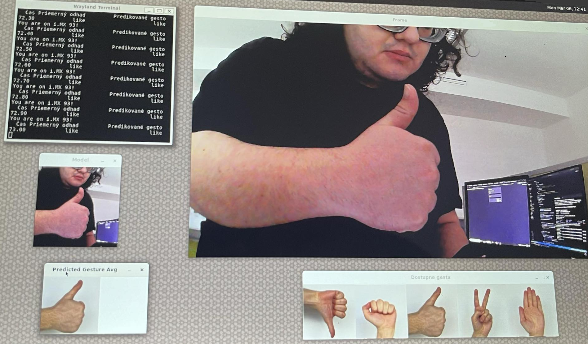

# Bachelor's thesis on implementing gesture recognition on ARM devices
<p align="middle">


</p>

### Author: Richard Gajdošík with help from NXP and VUT FIT

This project shows how to train image classification on top of MobilNetV2 model and implements real-time gesture recognition on an ARM-based i.MX 93 device or on x64 device using TensorFlow Lite while also providing already trained and converted tflite file for immediate inferencing.



## Requirements

- Linux (preferably Ubuntu 22.04) for training and inference.
- [Embedded linux](https://www.nxp.com/design/design-center/software/embedded-software/i-mx-software/embedded-linux-for-i-mx-applications-processors:IMXLINUX) if on ARM device 
- Python Version: 3.10.12
- TensorFlow 2.15 (Because we need legacy support for Keras 2)
- All Python libraries are listed in `requirements.txt`

## Installation

To install the necessary Python packages, run:

```bash
git clone git@github.com:RichardGajdosik/Gesture_Recognition_NXP_VUTFIT.git
cd Gesture_Recognition_NXP_VUTFIT
sudo apt install python3.10-venv
python3 -m venv venv
source venv/bin/activate
pip install -r requirements.txt
cd src
```
## Running the training

The main script for training is designed to take images that are in dataset directory divided into directories by the type of gesture (dislike, fist, like, peace, stop) and train on them the top classification layer of MobilNetV2. The images during training are being resized to 224x224 so when populating the dataset we have to make sure the gestures will be visible at that size and format of 1:1.

Thanks to the small size of the images and small number of images and model of MobilNetV2 optimized for mobile devices the training only takes a few minutes even when training on CPU.

The training has to be done on x64 platform because the training script is missing includes of libraries for ARM devices.

```bash
python3 training_mobilnetv2.py
```

## Converting the model to TFLite

After training there will be final_model directory in the root of the git repository that will need to be converted into TFLite file in order to be able to run inference.

The converting has to be done on x64 platform because the converting script is missing includes of libraries for ARM devices.


```bash
python3 scripts_python/convert.py
```

## Running the Inference

The main script for the inference is designed to process video or webcam inputs for gesture recognition and if webcam is chosen graphically show the results, otherwise only prints onto console will be shown with the predicted gesture. It can be executed with the following command-line arguments:

- `--filename`: Specify the name of the video or image input file. Default is 'video_device.mp4'.
- `--graph`: Specify the .tflite file if different from 'model.tflite'. Default is 'model.tflite'.
- `--input_type`: Type of input, can be 'webcam' or 'videofile'. Default is 'webcam'.
- `--platform`: Type of platform, can be 'arm' or 'x64'. Default is 'arm'.

Example of running the script:

```bash
python3 inference_mobilnetv2.py --platform x64 --filename video_test.mp4 --input_type videofile --graph model_float32epoch20_mobilnetv2_100_per_gesture.tflite
```

## Acknowledgements
I would like to thank Ing. Radek Kočí, Ph.D. from VUT FIT, and Ing. Zdeněk Záděra from NXP Brno for their supervision, significant support and contributions.


This project makes use of the HaGRID — HAnd Gesture Recognition Image Dataset, created by Alexander Kapitanov, Karina Kvanchiani, Aleksander Nagaev, Roman Kraynov, and Andrey Makhlyarchuk. The dataset was obtained from [GITHUB](https://github.com/hukenovs/hagrid). I appreciate the effort of the creators and their contribution to the research community.

## Sources

[Embedded linux](https://www.nxp.com/docs/en/user-guide/IMX_LINUX_USERS_GUIDE.pdf)

[Model - MobileNetV2](https://www.tensorflow.org/api_docs/python/tf/keras/applications/mobilenet_v2/MobileNetV2)

[Machine learning](https://www.nxp.com/docs/en/user-guide/IMX-MACHINE-LEARNING-UG.pdf)

[Model conversion to TFLite](https://www.tensorflow.org/lite/models/convert)

[Inference with TensorFlow](https://www.tensorflow.org/lite/guide/inference)
