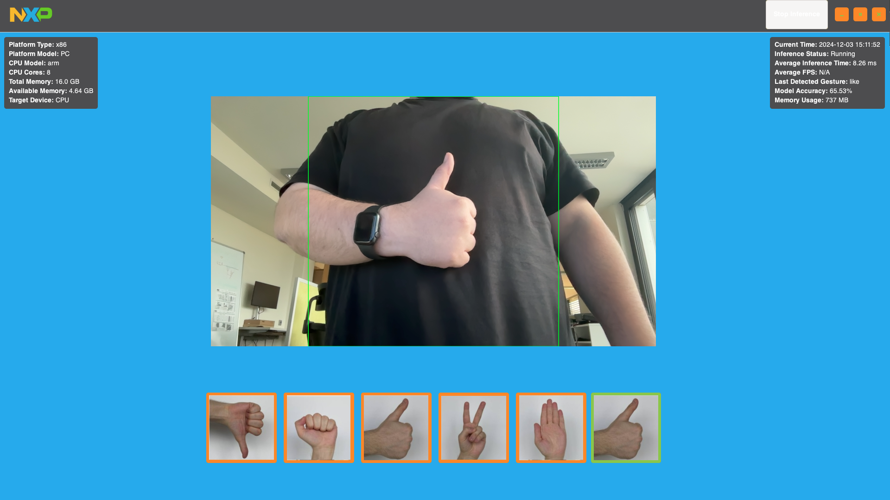

# Gesture Recognition Demo Application for NXP MPU 
<p align="middle">


</p>

### Author: Richard Gajdošík (NXP Semiconductors)

This project is a continuation and enhancement of my previous work on implementing gesture recognition on ARM devices, originally developed as my bachelor’s thesis. The project demonstrates how to train image classification on top of the MobileNetV2 model and implements real-time gesture recognition on an ARM-based i.MX 93 device or on an x64 device using TensorFlow Lite. It also provides an already trained and converted .tflite file for immediate inference together with already made application with UI.



## Requirements

- Linux (preferably Ubuntu 22.04) for training and inference.
- [Embedded linux](https://www.nxp.com/design/design-center/software/embedded-software/i-mx-software/embedded-linux-for-i-mx-applications-processors:IMXLINUX) if on ARM device 
- Python Version: 3.10.12
- TensorFlow 2.15 (Because we need legacy support for Keras 2)
- All Python libraries are listed in `requirements.txt`

## Installation

To install the necessary Python packages, run:

```bash
git clone git@github.com:RichardGajdosik/Gesture_Recognition_NXP_VUTFIT.git
cd Gesture_Recognition_NXP_VUTFIT
sudo apt install python3.10-venv
python3 -m venv venv
source venv/bin/activate
pip install -r requirements.txt
cd src
```
## Running the training

The main script for training is designed to take images that are in the dataset directory, divided into directories by the type of gesture (dislike, fist, like, peace, stop), and train the top classification layer of MobileNetV2 on them. The images during training are resized to 224x224, so when populating the dataset, ensure that the gestures are visible at that size and in a 1:1 format.

Thanks to the small size of the images, small number of images, and the MobileNetV2 model optimized for mobile devices, the training only takes a few minutes even when training on CPU.

Note: The training has to be done on an x64 platform because the training script is missing includes of libraries for ARM devices.

```bash
python3 training_mobilnetv2.py
```

## Converting the model to TFLite

After training, there will be a final_model directory in the root of the git repository that needs to be converted into a TFLite file to be able to run inference.

Note: The conversion has to be done on an x64 platform because the converting script is missing includes of libraries for ARM devices.


```bash
python3 scripts_python/convert.py
```

## Running the Inference

The main script for inference is inference_universal_UI.py, which runs a new UI made in GTK 3.0. It can be executed with the following command-line arguments:
- `--target`: Specify whether to run inference on ‘CPU’ or ‘NPU’. Default is 'CPU'.
- `--model`: Name of the .tflite file with path to it from the script. Default is `models/model_float32epoch20_mobilnetv2_100_per_gesture.tflite`.

Example of running the script:

```bash
python3 inference_universal_UI.py --target CPU --model models/model_float32epoch20_mobilnetv2_100_per_gesture.tflite
```

The universal application automatically recognizes if it is being run on NXP MPU and automatically links needed delegates for NPU acceleration.

## Acknowledgements
I would like to thank Ing. Radek Kočí, Ph.D. from VUT FIT, and Ing. Zdeněk Záděra from NXP Brno for their supervision, significant support and contributions.


This project makes use of the HaGRID — HAnd Gesture Recognition Image Dataset, created by Alexander Kapitanov, Karina Kvanchiani, Aleksander Nagaev, Roman Kraynov, and Andrey Makhlyarchuk. The dataset was obtained from [GITHUB](https://github.com/hukenovs/hagrid). I appreciate the effort of the creators and their contribution to the research community.

## Sources

[Bachelor's thesis](https://github.com/RichardGajdosik/Gesture_Recognition_NXP_VUTFIT)

[Embedded linux](https://www.nxp.com/docs/en/user-guide/IMX_LINUX_USERS_GUIDE.pdf)

[Model - MobileNetV2](https://www.tensorflow.org/api_docs/python/tf/keras/applications/mobilenet_v2/MobileNetV2)

[Machine learning](https://www.nxp.com/docs/en/user-guide/IMX-MACHINE-LEARNING-UG.pdf)

[Model conversion to TFLite](https://www.tensorflow.org/lite/models/convert)

[Inference with TensorFlow](https://www.tensorflow.org/lite/guide/inference)
